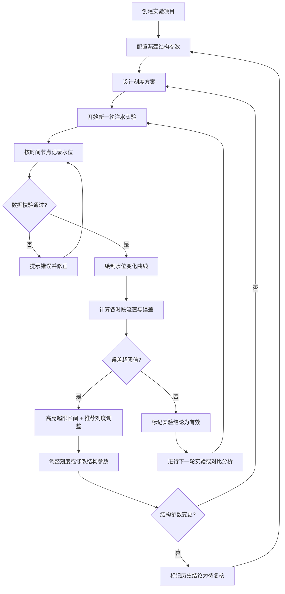

## 1. 产品概述

古代漏刻复原与校准研究系统，为博物馆研究团队提供注水实验平台，通过配置漏壶结构参数、设计刻度方案、录入实验数据，分析水位变化与流速关系，计算计时误差并推荐刻度调整方案。

- 核心目标：帮助研究人员科学复原不同结构的古代漏刻，量化分析计时精度
- 目标用户：博物馆文物保护与古代科技史研究人员
- 产品价值：将传统工艺研究数字化，建立可重复、可对比的实验方法论

---

## 2. 核心功能

### 2.1 用户角色
| 角色 | 注册方式 | 核心权限 |
|------|---------|---------|
| 研究人员 | 系统内置（单用户模式） | 项目管理、配置漏壶、录入数据、分析结果 |

### 2.2 功能模块
1. **实验项目管理**：创建/编辑/删除项目，项目列表概览，状态追踪
2. **漏壶结构配置**：容量、进水方式、出水孔径、目标计时时长、复核状态标记
3. **刻度方案设计**：刻度数量、位置标记、目标水位-时间映射表
4. **实验数据录入**：多轮实验管理，时间节点递增校验，水位记录录入
5. **多轮实验对比**：曲线叠加对比，误差趋势分析
6. **误差分析与推荐**：时段误差计算，阈值超限高亮，刻度调整位置推荐

### 2.3 页面详情
| 页面名称 | 模块名称 | 功能描述 |
|---------|---------|---------|
| 项目总览页 | 项目卡片列表 | 展示所有实验项目，显示项目状态、最新实验轮次、结论复核标记 |
| 项目总览页 | 新建项目入口 | 快速创建新实验项目，输入项目名称与研究目标 |
| 配置与实验页 | 漏壶结构配置面板 | 配置容量/进水方式/出水孔径/目标时长，参数变更触发待复核标记 |
| 配置与实验页 | 刻度方案设计器 | 可视化刻度线布局，设定各刻度目标时间与对应水位 |
| 配置与实验页 | 实验数据录入区 | 按轮次管理，逐条录入时间节点与实际水位，内置数据校验 |
| 配置与实验页 | 水位变化曲线图 | Plotly.js 绘制多轮实验水位曲线，支持悬停查看细节 |
| 配置与实验页 | 误差分析仪表盘 | 时段误差计算表、超限区间红色高亮、刻度调整推荐列表 |
| 配置与实验页 | 多轮实验对比区 | 选择多个轮次叠加对比，展示误差趋势变化 |

---

## 3. 核心流程

研究人员从创建项目开始，配置漏壶物理参数，设计初始刻度方案，然后进行多轮注水实验，每轮按时间节点记录实际水位。系统自动计算各时段流速与计时误差，对比理论值与实测值，对超阈值区间进行醒目标识，并推荐需要调整的刻度位置。修改结构参数后，原有实验结论自动标记为"待复核"。

---

## 4. 用户界面设计

### 4.1 设计风格
- **主色调**：深褐色系（#5C4033 主色，#8B6914 辅助色），契合古代器物研究主题
- **点缀色**：朱砂红（#C23B22）用于误差超限警示
- **成功色**：青绿（#4A7C59）用于数据有效标识
- **背景**：米白色仿古宣纸纹理（#FAF6F0）
- **按钮风格**：圆角 6px，微立体阴影，悬停上浮过渡
- **字体**：标题用「思源宋体」呼应学术感，正文用「思源黑体」保证可读性
- **布局风格**：左右分栏卡片式布局，左侧导航+配置，右侧数据可视化与分析
- **图标风格**：线性古风图标，融入水纹、刻度等隐喻元素

### 4.2 页面设计概述
| 页面名称 | 模块名称 | UI 元素 |
|---------|---------|---------|
| 项目总览页 | 顶部导航栏 | 古风 Logo、系统标题、当前用户 |
| 项目总览页 | 项目卡片网格 | 卡片悬停微抬升、状态标签（待复核/进行中/已完成）、创建时间 |
| 项目总览页 | 新建项目浮动按钮 | 右下角圆形加号按钮，脉冲动画提示 |
| 配置与实验页 | 左侧配置面板 | 折叠式卡片组，参数输入框带单位后缀，实时校验提示 |
| 配置与实验页 | 顶部轮次切换标签 | 胶囊式标签，待复核徽章红色圆点，当前轮次高亮 |
| 配置与实验页 | 水位曲线图 | 仿古描边风格网格线，多色折线区分轮次，图例可点击过滤 |
| 配置与实验页 | 误差分析表格 | 斑马纹行，超限行整行红色背景闪烁，调整推荐列带箭头图标 |
| 配置与实验页 | 刻度方案可视化条 | 横向刻度尺，可拖拽调整刻度位置，超限刻度红色发光 |

### 4.3 响应式
- 桌面端优先（≥1280px）：左右分栏，左 380px 配置区，右自适应内容区
- 平板端（768-1279px）：上下堆叠，配置区压缩为顶部折叠面板
- 移动端（<768px）：单列布局，图表自适应容器宽度，关键操作按钮固定底部

---
