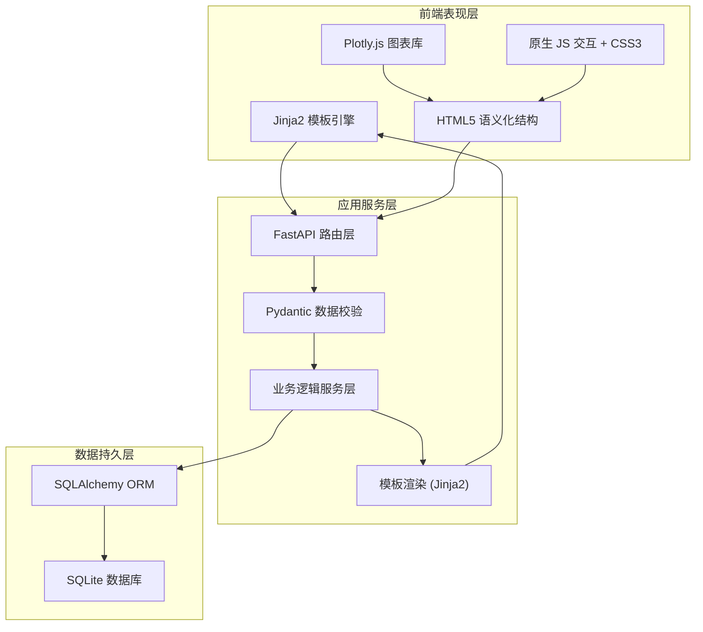
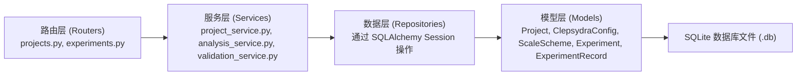
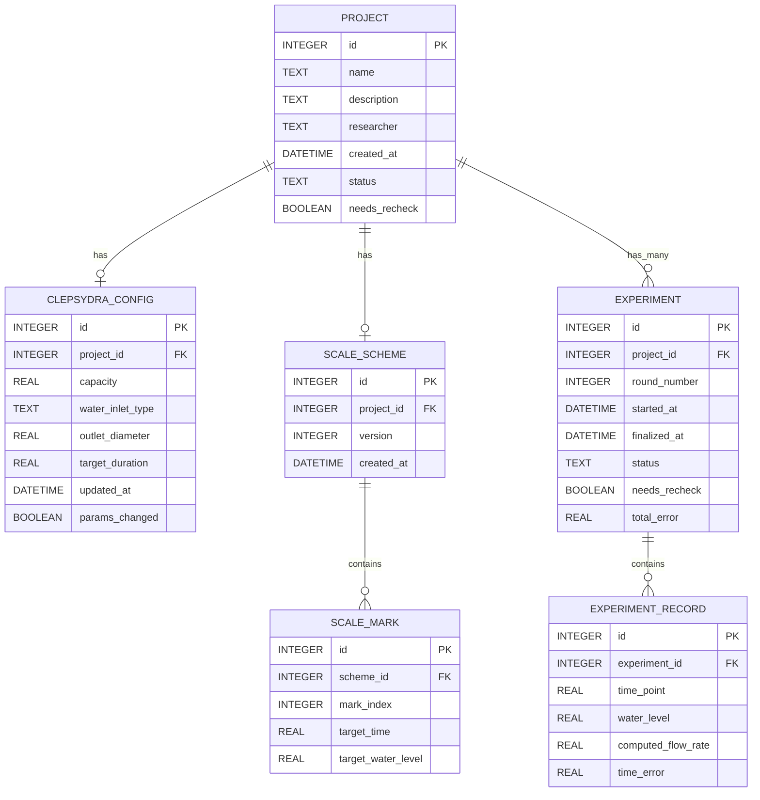

## 1. 架构设计



---

## 2. 技术描述

- **Web 框架**：FastAPI (Python 3.10+) —— 高性能异步支持，自动生成 API 文档
- **模板引擎**：Jinja2 —— 服务端渲染，继承式模板复用
- **数据库**：SQLite3 + SQLAlchemy 2.0 —— 零配置嵌入式数据库，ORM 映射
- **数据校验**：Pydantic v2 —— 请求/响应模型，类型安全
- **前端图表**：Plotly.js CDN —— 交互式科学绘图，支持多序列叠加
- **前端样式**：CSS3 自定义变量 + 仿古设计主题
- **前端交互**：原生 JavaScript (ES2020) —— 无额外构建依赖
- **异步支持**：ASGI (Uvicorn) 开发服务器

---

## 3. 路由定义

| 路由方法 | 路由路径 | 用途 |
|---------|---------|------|
| GET | `/` | 项目总览页（首页） |
| GET | `/projects/new` | 新建项目表单页 |
| POST | `/projects` | 创建新项目 |
| GET | `/projects/{id}` | 项目配置与实验主页面 |
| POST | `/projects/{id}/config` | 更新漏壶结构配置 |
| POST | `/projects/{id}/scale` | 保存/更新刻度方案 |
| GET | `/projects/{id}/experiments/new` | 创建新一轮实验（重定向） |
| POST | `/projects/{id}/experiments/{eid}/records` | 录入实验记录 |
| DELETE | `/projects/{id}/experiments/{eid}/records/{rid}` | 删除单条记录 |
| POST | `/projects/{id}/experiments/{eid}/finalize` | 完成本轮实验并计算误差 |
| GET | `/projects/{id}/analysis` | 获取误差分析与推荐 JSON |
| DELETE | `/projects/{id}` | 删除项目及所有关联数据 |
| POST | `/projects/{id}/experiments/{eid}/recheck` | 标记/取消待复核状态 |

---

## 4. API 请求/响应模型

### 4.1 项目模型
```python
class ProjectCreate(BaseModel):
    name: str = Field(..., min_length=2, max_length=100)
    description: str | None = Field(default=None, max_length=500)
    researcher: str | None = Field(default=None, max_length=50)

class ProjectOut(ProjectCreate):
    id: int
    created_at: datetime
    status: str
    experiment_count: int
```

### 4.2 漏壶配置模型
```python
class ClepsydraConfigUpdate(BaseModel):
    capacity: float = Field(..., gt=0, description="漏壶容量 (ml)，必须大于0")
    water_inlet_type: str = Field(..., pattern="^(constant|gravity|manual)$")
    outlet_diameter: float = Field(..., gt=0, description="出水孔径 (mm)，必须大于0")
    target_duration: float = Field(..., gt=0, description="目标计时时长 (分钟)")
```

### 4.3 刻度方案模型
```python
class ScaleMark(BaseModel):
    mark_index: int
    target_time: float = Field(..., ge=0)
    target_water_level: float = Field(..., gt=0)

class ScaleSchemeUpdate(BaseModel):
    marks: list[ScaleMark]
```

### 4.4 实验记录模型
```python
class ExperimentRecordCreate(BaseModel):
    time_point: float = Field(..., gt=0, description="时间节点 (分钟)")
    water_level: float = Field(..., ge=0, description="实测水位 (ml)")

class ExperimentRecordOut(ExperimentRecordCreate):
    id: int
    flow_rate: float | None
    time_error: float | None
```

### 4.5 误差分析响应
```python
class ErrorAnalysisOut(BaseModel):
    experiment_id: int
    total_error: float
    max_error: float
    interval_errors: list[dict]  # [{interval, expected_level, actual_level, error, exceeded}]
    adjustment_recommendations: list[dict]  # [{mark_index, suggested_level, direction, reason}]
```

---

## 5. 服务端分层架构



---

## 6. 数据模型

### 6.1 ER 关系图



### 6.2 数据校验规则（业务约束）
```
1. capacity > 0 AND outlet_diameter > 0 AND target_duration > 0
2. 同一 experiment_id 下 time_point 必须严格递增且唯一
3. water_level ≤ capacity（漏壶容量上限约束）
4. scale_mark.target_water_level ≤ capacity
5. 修改 ClepsydraConfig 任一字段 → 所有关联 experiment.needs_recheck = TRUE
6. 误差阈值默认 ±5%，超过则 interval_errors[].exceeded = TRUE
```

---

## 7. 项目目录结构

```
lf-39/
├── main.py                    # FastAPI 应用入口
├── requirements.txt           # Python 依赖清单
├── .env.example               # 环境变量示例
├── database/
│   ├── __init__.py
│   ├── connection.py          # SQLAlchemy 引擎与 Session
│   └── models.py              # ORM 模型定义
├── schemas/
│   ├── __init__.py
│   ├── project.py             # Pydantic 项目模型
│   ├── config.py              # 配置模型
│   ├── experiment.py          # 实验与记录模型
│   └── analysis.py            # 分析结果模型
├── services/
│   ├── __init__.py
│   ├── project_service.py     # 项目 CRUD 逻辑
│   ├── analysis_service.py    # 误差计算与推荐
│   └── validation_service.py  # 业务规则校验
├── routers/
│   ├── __init__.py
│   ├── web.py                 # 页面渲染路由
│   ├── projects.py            # 项目 API
│   └── experiments.py         # 实验数据 API
├── templates/
│   ├── base.html              # 基础布局模板
│   ├── index.html             # 项目总览页
│   ├── project_detail.html    # 配置与实验主页
│   └── components/
│       ├── config_panel.html  # 漏壶配置组件
│       ├── scale_designer.html# 刻度设计器
│       ├── data_entry.html    # 数据录入区
│       └── analysis_dashboard.html# 误差分析仪表盘
├── static/
│   ├── css/
│   │   └── theme.css          # 仿古主题样式
│   └── js/
│       ├── chart.js           # Plotly 图表封装
│       ├── validation.js      # 前端校验逻辑
│       └── interaction.js     # 交互行为
└── instance/
    └── clepsydra.db           # SQLite 数据库文件（自动创建）
```

---
